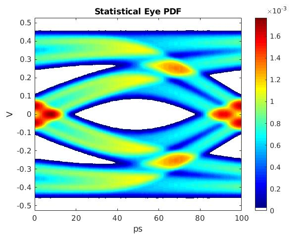
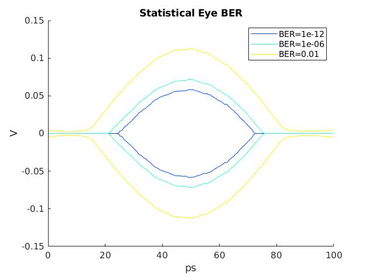

# simpleStatEye
*Generate Statistical BER with Matlab **pulse2stateye** function.
Due to this function only output PDF of eye, postprocessing is needed which cumulative sum PDF.*
- Probability Density Function(PDF) plot\

- Bit Error Rate(BER) plot\

